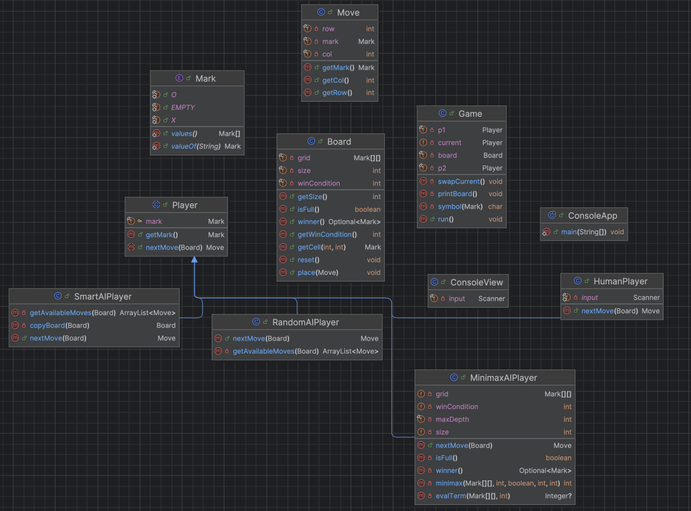

# Tic-Tac-Toe (Java, Encapsulation, Inheritance) <

## Introduction
A Tic-Tac-Toe game that focuses on encapsulation and inheritance.

**Tools:** Java 17+, any IDE (IntelliJ/Eclipse/VS Code), GitHub Classroom (recommended)

## How to Run
Launch and run ConsoleApp.java

## Design Rationale

### Extensions

**SmartAIPlayer:** A smart AI player that uses basic heuristics to determine winning opportunities and blocking the opponent from winning.
**NxN Board:** Parameterize size; make win condition configurable (e.g., 3‑in‑a‑row on any N).
**MiniMax AI:** A smart AI player that uses DFS algorithm and assign heuristic values to terminal states and backtracks to determine the fastest way to win. It also utilizes Alpha-Beta pruning to cut search trees that won't affect the decision and optimize performance.

## UML Sketch


## Reflection

**Encapsulation** prevented bugs by ensuring attributes or methods can not be accessed or changed by other parts of the program. For example, in `Board`, the `grid` can not be changed by any other part of the program, unless through proper methods such as `place` or `reset`. Had grid been public, the grid could be accidentally changed outside of proper methods and cause unintended behavior. Another example is how `Player` has a protected attribute `mark`, which allows it to be used by the subclasses of players (`HumanPlayer`, `RandomAIPlayer`, etc…) but can not be directly changed outside. If outside programs could change the attribute, that would reassign the `Player` instance’s mark (`X`, `O`) and mess up the game logic.

**Inheritance** is used throughout the program, specifically in `Player` and its subclasses. The reason why inheritance is utilized is to create a clear family of classes that relate to the `Player` logic in the game. Every type of player in this game has to share the same logic, and that logic is blueprinted in the abstract class `Player`. An important function overridden by the subclasses of `Player` is `nextMove()`, which returns the player or AI’s move to the `Game` logic. However, each subclass of `Player` has a different implementation of `nextMove()`. For example, `HumanPlayer` implements it by prompting the user for a row and column and creating the `Move` object with the inputted row and column and returning it. The AI players such as `RandomAIPlayer` and `SmartAIPlayer` implement it by getting the current available moves and implementing logic to determine the best row and column for the move and returning the new `Move` object.

Since we already implemented dynamic NxN board sizes and n-in-a-row conditions in the GUI, we would not have to refactor the code. The `Board` class has the constructor 
```Java
public Board(int size, int winCondition)
```
which allows the Board to be instantiated with a custom `size` and `winCondition`, where `winCondition` is the amount in a row in order to win the game. However, the game GUI already prompts the user for the size and the win condition before creating and running the game, allowing the user flexibility in how they want to play the game.

